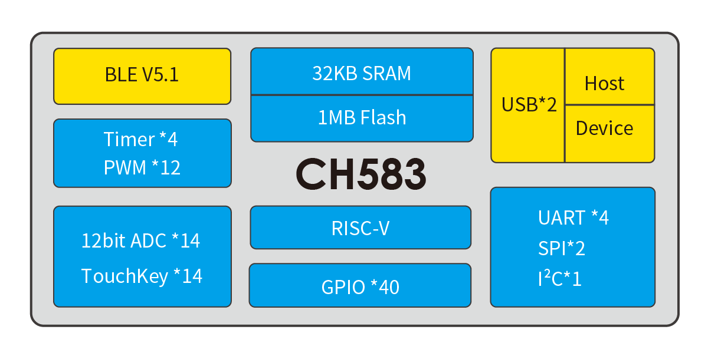
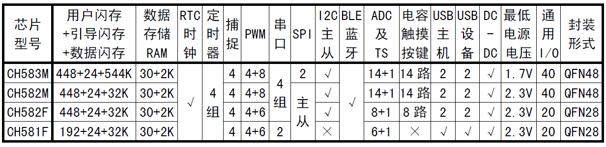

# [CH583](https://github.com/SoCXin/CH583)

* [WCH](http://www.wch.cn/)：[RISC-V4A](https://github.com/SoCXin/RISC-V)
* [L2R2](https://github.com/SoCXin/Level)：20 MHz

## [简介](https://github.com/SoCXin/CH583/wiki)

[CH583](https://github.com/SoCXin/CH583) 集成BLE无线通讯的32位RISC微控制器。片上集成2Mbps低功耗蓝牙BLE 通讯模块、2个全速USB主机和设备控制器及收发器、2个SPI、4个串口、ADC、触摸按键检测模块、RTC等丰富的外设资源。

#### 关键特性

* 32KB SRAM，1MB Flash，支持ICP、ISP和IAP，支持OTA无线升级
* 2.4GHz RF收发器和基带及链路控制，支持BLE5.1
* 接收灵敏度-98dBm，可编程+7dBm发送功率
* 2组USB2.0 全速Host/Device
* 4组UART，2组SPI，12路PWM，1路IIC

### [资源收录](https://github.com/SoCXin)

* [参考资源](src/)
* [参考文档](docs/)
* [参考工程](project/)
* [入门文档](https://docs.soc.xin/CH583)

### [选型建议](https://github.com/SoCXin)

[CH583](https://github.com/SoCXin/CH583)

### [探索芯世界 www.SoC.xin](http://www.SoC.Xin)
