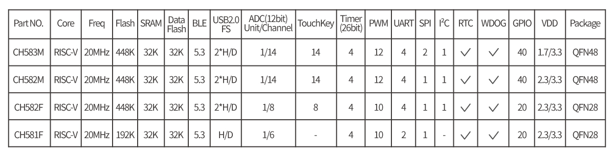

# [CH583](https://github.com/SoCXin/CH583)

* [WCH](http://www.wch.cn/)：[RISC-V4A (RV32IMAC)](https://github.com/SoCXin/RISC-V)
* [L1R1](https://github.com/SoCXin/Level)：20/80 MHz (1.56DMIPS) , [￥4.43 (QFN48)](https://item.szlcsc.com/3226374.html)

## [简介](https://github.com/SoCXin/CH583/wiki)

[CH583](https://www.wch.cn/products/CH583.html) 集成BLE无线通讯的32位RISC微控制器。片上集成2Mbps低功耗蓝牙BLE 通讯模块、2个全速USB主机和设备控制器及收发器、2个SPI、4个串口、ADC、触摸按键检测模块、RTC等丰富的外设资源。

**PIO编译生成BIN而非HEX，目前无法通过WCHISPTool进行烧录**

### 关键特性

* 20/80 MHz RISC-V4A (RV32IMAC)
* 32KB SRAM + 448KB Flash
* BLE5.3 接收灵敏度-98dBm，可编程+7dBm发送功率
* 2x USB1.1 H/D
* 4xUART，SPI，12x PWM，IIC
* 14x TouchPad

## [资源收录](https://github.com/SoCXin)

* [参考资源](src/)
* [参考文档](docs/)
* [参考工程](project/)

## [选型建议](https://github.com/SoCXin)

目前主要销售的[CH582](https://item.szlcsc.com/3226374.html)相对[CH583](https://github.com/SoCXin/CH583) 减少了一组SPI和512KB Flash，也不支持最低1.7V的电源供电电压。

CH581 则相对 CH582 再去掉了一组USB、触摸按键、I2C模块和两个串口，FlashROM总容量仅256KB，同时ADC也不支持DMA。

就低功耗BLE MCU而言，目前国内主要竞品包括 [BL706/BL702](https://github.com/SoCXin/BL706)，后者定位更高，封装相似，拥有更丰富的外设。

[CH583](https://github.com/SoCXin/CH583)最新升级型号[CH592](https://github.com/SoCXin/CH592)支持BLE 5.4，但是减少了外设配置，只保留一组USB

同品牌相似系列[CH32V208](https://www.wch.cn/products/CH32V208.html)

## [开源集锦](https://github.com/OS-Q)

* [PikaPython](https://github.com/OS-Q/PikaPython)
* [PlatformIO](https://github.com/OS-Q/platform-ch32v)
* [DAPLink](https://github.com/SoCXin/DAPLink-CH582)

